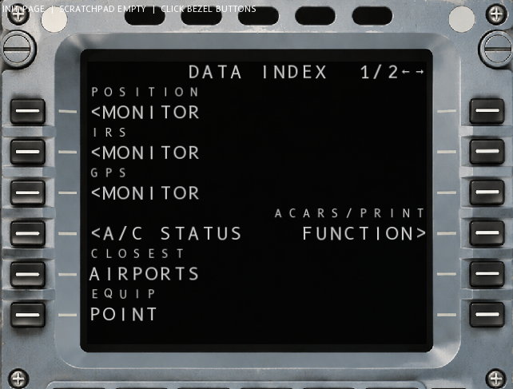

# OPEN MCDU

Open-source A320 MCDU (Multifunction Control and Display Unit) simulator in C++20.
Follows the ARINC 739 14x24 character grid standard used in real Airbus aircraft.

<div align="center">
  
  
  
  
  
</div>

---

## Architecture

The MCDU core (`src/MCDU/`, `src/Core/`) has **zero** dependencies on any graphics or windowing library — just C++20 stdlib. It produces a `ScreenBuffer` (14x24 grid of `{codepoint, color, fontSize}`) that any renderer can turn into pixels.

```
 ┌─────────────────────────────────────────────┐
 │          Your application                    │
 │                                              │
 │  Event handler → mcdu.handleButton(btn)     │
 │  Char input    → mcdu.inputChar(ch)         │
 │                                              │
 │  ┌───────────────────────────────────────┐  │
 │  │  MCDU (pure logic)                    │  │
 │  │  screen() → ScreenBuffer (14x24 grid) │  │
 │  │  hitTestLsk(x,y) → MCDUButton         │  │
 │  │  updateBus(now)  → tick DataBus       │  │
 │  └─────────────────┬─────────────────────┘  │
 │                    │                         │
 │  ┌─────────────────▼─────────────────────┐  │
 │  │  Your renderer                        │  │
 │  │  Read ScreenBuffer → render to pixels  │  │
 │  │  Upload as OpenGL texture / X-Plane    │  │
 │  └───────────────────────────────────────┘  │
 └─────────────────────────────────────────────┘
```

The MCDU is a **passive object** — you call it, it doesn't call you. No callbacks to register.

### Key components

| Component | Header | Role |
|-----------|--------|------|
| `MCDU` | `MCDU/MCDU.h` | Page routing, button dispatch, screen rebuild, scratchpad |
| `FMGC` | `Core/FMGC.h` | Flight data, nav database, flight plan, runs on separate thread at 20 Hz |
| `DataBus` | `Core/DataBus.h` | Two thread-safe unidirectional buses (MCDU→FMGC, FMGC→MCDU) with ARINC labels |
| `ScreenBuffer` | `MCDU/ScreenBuffer.h` | 14×24 grid of per-cell `{codepoint, color, fontSize}` |
| `FieldRenderer` | `MCDU/Field.h` | Stateless rendering helpers: `text()`, `box()`, `slash()`, `character()`, `dashLine()` |
| `Page` | `MCDU/Field.h` | Base class — override `buildScreen()` and `getClickHandler()` |

### DataBus (ARINC 429 simulation)

Two unidirectional, mutex-protected queues:
- **Bus A** (MCDU → FMGC): transmit with ARINC label + payload + SSM
- **Bus B** (FMGC → MCDU): receive responses

FMGC polls Bus A at 20 Hz, processes messages (validation, computation), and sends responses to Bus B with simulated latency. This produces the "---- pending" state on computed fields while waiting for FMGC response.

The bus also serves as a record/replay point for data flow analysis in simulators.

### Button wiring

All bezel buttons are enumerated in `MCDUButton` (`MCDU/MCDUButton.h`). Your input adapter maps platform events to these enums:

```cpp
// GLFW adapter — ~30 lines
void onKeyPress(GLFWwindow*, int key, int, int action, int) {
    if (action != GLFW_PRESS) return;
    switch (key) {
        case GLFW_KEY_F1:  mcdu.handleButton(MCDUButton::DIR);   break;
        case GLFW_KEY_F5:  mcdu.handleButton(MCDUButton::INIT);  break;
        case GLFW_KEY_F6:  mcdu.handleButton(MCDUButton::FPLN);  break;
        case GLFW_KEY_UP:  mcdu.handleButton(MCDUButton::SCROLL_UP);   break;
        case GLFW_KEY_DOWN: mcdu.handleButton(MCDUButton::SCROLL_DOWN); break;
        default: break;
    }
}

// Hit-test mouse clicks against the bezel image
void onMouseClick(GLFWwindow*, int btn, int action, int) {
    if (btn == GLFW_MOUSE_BUTTON_LEFT && action == GLFW_PRESS) {
        double x, y; glfwGetCursorPos(window, &x, &y);
        MCDUButton hit = mcdu.hitTestLsk((float)x, (float)y);
        if (hit != MCDU::NO_HIT) mcdu.handleButton(hit);
    }
}

void onCharInput(GLFWwindow*, unsigned int codepoint) {
    mcdu.inputChar((char)codepoint);
}
```

### Screen output

`ScreenBuffer` exposes each cell as:

```
struct Cell {
    uint32_t ch;        // Unicode codepoint
    CellColor color;    // GREEN, AMBER, WHITE, CYAN, YELLOW, DIM
    uint8_t fontSize;   // 22 (data) or 14 (labels)
};
```

Render with any backend — the demo app uses SFML but the core has no graphics dependency. Here's a minimal GLFW + stb\_truetype main loop:

```cpp
#include "Core/DataBus.h"
#include "Core/FMGC.h"
#include "MCDU/MCDU.h"

DataBus bus;
FMGC   fmgc(bus);
MCDU   mcdu(fmgc, bus);

fmgc.loadXPlaneFix("ext_data/earth_fix.dat");
fmgc.loadAirportsCSV("ext_data/airports.csv");
fmgc.start();   // launch 20 Hz FMGC thread

// In your render loop:
while (running) {
    pollInput();                        // glfwPollEvents(), etc.
    mcdu.updateBus(now);                // tick bus timers

    mcdu.rebuildScreen();               // poll FMGC, redraw

    const ScreenBuffer& buf = mcdu.screen();
    // Read buf.at(row, col) → render characters
    // Any backend: stb_truetype, Cairo, raw glyph atlas, SFML, etc.
}
```

---

## Display colors

| Color  | Use                                   |
|--------|---------------------------------------|
| GREEN  | Data, placeholder dashes              |
| AMBER  | Warnings, empty fields, pending state |
| WHITE  | Labels, normal text                   |
| CYAN   | Filled data fields                    |
| YELLOW | EDIT mode (temp flight plan)          |
| DIM    | Separators                            |

---

## Building

```bash
cmake -B build -S . \
  -DCMAKE_TOOLCHAIN_FILE=/path/to/vcpkg/scripts/buildsystems/vcpkg.cmake
cmake --build build --config Debug
```

Requires: C++20 compiler, CMake 3.20+, vcpkg (installs SFML for the demo app).

---

## Asset requirements

| Asset | Source |
|-------|--------|
| `assets/MCDU.png` | Bezel image (included) |
| `assets/B612-Regular.ttf` | Modified B612 font with U+25AF box marker (included) |
| `ext_data/earth_fix.dat` | X-Plane 12 `Resources/default data/` |
| `ext_data/earth_nav.dat` | X-Plane 12 `Resources/default data/` |
| `ext_data/airports.csv` | [OurAirports](https://davidmegginson.github.io/ourairports-data/) |

X-Plane nav data is **not** included in this repo. Copy from your X-Plane installation.
The app compiles and runs without nav data (validation will fail on unknown airports).

---

## Making a new page

1. Create a header in `src/Pages/` extending `Page` (defined in `MCDU/Field.h`)
2. Implement `buildScreen(buf)` — render layout using `FieldRenderer::text()`, `box()`, `slash()`, etc.
3. Implement `getClickHandler(side, lskIdx)` — return `ClickHandler` with `busLabel`, `valuePtr`, or `navTarget`
4. Register in `MCDU.h`: `m_stateMachine.registerPage("NAME", std::make_unique<MyPage>())`

The `ClickHandler` struct tells the state machine what to do when a bezel button is pressed:

| Field | Purpose |
|-------|---------|
| `busLabel` | ARINC label to send on DataBus (0 = no-op) |
| `isDirectAction` | Fire without consuming scratchpad |
| `valuePtr` | Scratchpad read-back target |
| `navTarget` | Page to switch to (e.g. `"AC_STATUS"`) |

No slot arrays, no callbacks — just one override per page.

### FieldRenderer API

| Function | Purpose |
|----------|---------|
| `text(buf, row, col, str, color, fontSize=22)` | Plain text with explicit size |
| `box(buf, row, col, w, content, fillColor, emptyColor, align)` | Empty = ▯▯▯ / filled = content |
| `slash(buf, row, col, lw, rw, left, right, color)` | `left-box / right-box` |
| `character(buf, row, col, codepoint, color, size)` | Single Unicode codepoint |
| `separator(buf, row, col, w)` | Row of dim dashes |
| `dashLine(buf, row, col, w, color, size)` | Dashes with custom color |

All font sizes are explicit `uint8_t` (14 = labels, 22 = data text).

### Grid layout

| Row | Purpose |
|-----|---------|
| 0 | Title |
| 1 | LSK1/RSK1 label |
| 2 | LSK1/RSK1 data |
| 3–12 | Pairs for LSK2–LSK6 |
| 13 | Scratchpad |

Left content starts at col 0. Right content placed per page.

---

## Flight plan data model

Doubly-linked list of `FlightWaypoint` nodes with marker nodes for DISCONTINUITY and END OF F-PLN. EDIT mode deep-copies the plan — user edits the copy (yellow), then commits or erases.

Scrolling is circular — the viewport always shows 5 items and wraps around regardless of plan size.

---

## Nav database

`NavDatabase` loads from X-Plane 12 `.dat` format (fixes, VORs, NDBs) and OurAirports CSV. Thread-safe (mutex-protected merge).

- `earth_fix.dat` — waypoints (lat, lon, ID)
- `earth_nav.dat` — VORs, NDBs
- `airports.csv` — ICAO codes

---

## Asset credits

- MCDU bezel image: original artwork
- B612 font: PolarSys / Airbus, SIL Open Font License. Modified to add U+25AF box marker.
- Nav database files: Laminar Research. Licensed for use with X-Plane. Not included.
- Airports CSV: OurAirports / David Megginson, public domain.
- CIFP data: FAA, public domain (ILS/LOC procedures)

## License

MIT. See LICENSE.
