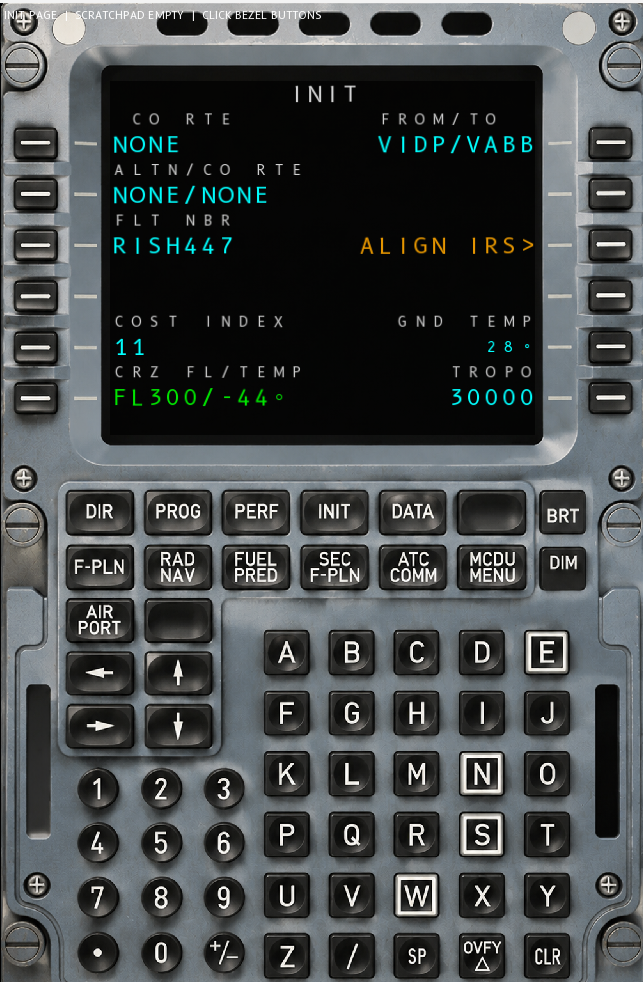
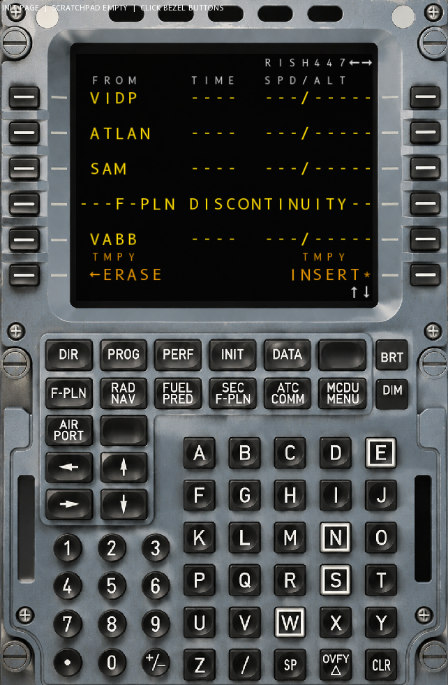
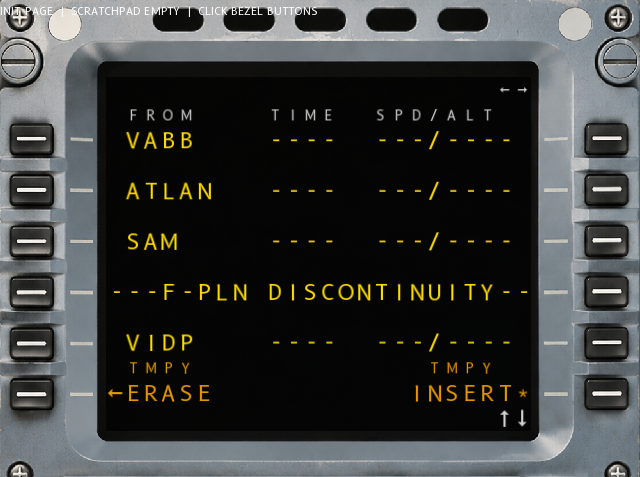
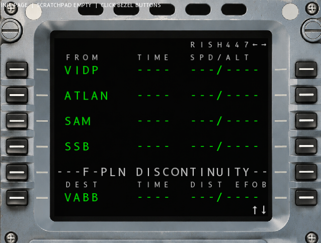

# OPEN MCDU

An open-source A320 MCDU (Multifunction Control and Display Unit) simulator. Built in C++20.

The MCDU follows the ARINC 739 14x24 character grid standard used in real Airbus aircraft.
It is fully rendering-agnostic and input-source-agnostic -- use it with GLFW, X-Plane, a web
viewer, custom cockpit hardware, or anything else.

<div align="center">
  
  
  
  
</div>

## Features

- ARINC-compliant 14x24 character LCD grid with per-cell color and font size
- Real bezel button layout with pixel-accurate hit detection (measured from reference image)
- LSK/RSK side keys, function keys, action keys, and numeric keypad -- all via `MCDUButton` enum
- Scratchpad input with CLR logic (clear char, CLR mode, message display)
- **ARINC 429-style DataBus** between MCDU and FMGC (two unidirectional buses, thread-safe)
- **FMGC runs on its own thread** at 20 Hz, processes messages asynchronously
- **Pending state** on display fields -- shows "----" while waiting for FMGC response
- Nav database parser for X-Plane .dat format (fixes, VORs, NDBs, airports)
- FROM/TO validation against real nav database, auto-fills NONE on CO ROUTE and ALTN
- CRZ FL/TEMP auto-format (FL300, ISA temperature interpolation)
- F-PLN page with circular scrolling and EDIT mode (deep-copy, ERASE/INSERT, YELLOW coloring)
- **No LSK slot arrays** -- pages just answer "what field is at this button?" through `getClickHandler()`
- **Rendering and input are fully decoupled** -- swap GLFW, X-Plane, SDL2, or any backend without touching the MCDU library

## Architecture overview

```
┌────────────────────────────────────────────────────────┐
│                   Your application                      │
│  (GLFW, X-Plane plugin, MSFS, hardware driver, etc.)   │
│                                                         │
│  Your 30-line adapter: platform events → MCDUButton     │
│  Your renderer: ScreenBuffer → pixel buffer → texture   │
└──────────────────────┬──────────────────────────────────┘
                       │
                       ▼
┌────────────────────────────────────────────────────────┐
│                    MCDU library                         │
│                                                         │
│  MCDU::handleButton(MCDUButton)  ← input entry point   │
│  MCDU::screen()  → ScreenBuffer  ← output (14x24 grid) │
│  MCDU::rebuildScreen()           ← process bus + redraw │
│                                                         │
│  Communicates with FMGC through DataBus (ARINC 429)     │
└──────────────────────┬──────────────────────────────────┘
                       │  DataBus (thread-safe, mutex)
                       ▼
┌────────────────────────────────────────────────────────┐
│                    FMGC (own thread, 20 Hz)              │
│                                                         │
│  Processes MCDU messages asynchronously                 │
│  Owns NavDatabase, FlightPlan, all flight data          │
│  Sends responses back through DataBus                   │
└────────────────────────────────────────────────────────┘
```

### No shared memory

The MCDU and FMGC communicate exclusively through the DataBus -- no shared structs, no direct function
calls. The MCDU maintains its own display state (McduDisplayState) that gets updated when the FMGC
sends responses. This means:

- MCDU and FMGC can run on separate threads (FMGC at 20 Hz, render at 60+ FPS)
- Fields show "----" (amber) while waiting for FMGC to acknowledge
- FMGC can reject data -- sends an error message that appears on the scratchpad
- The bus simulates configurable latency (default 30 ms)

## Integration guide

The MCDU library is `src/MCDU/` and `src/Core/`. Include these headers in your project.
You do NOT need SFML, GLFW, or any rendering library to use the MCDU logic.

### Step 1: Set up the components

```cpp
#include "Core/DataBus.h"
#include "Core/FMGC.h"
#include "MCDU/MCDU.h"

DataBus bus;          // ARINC 429-style message bus
FMGC   fmgc(bus);     // Flight computer (call start() for its own thread)
MCDU   mcdu(fmgc, bus);  // Display + input

// Load nav data (X-Plane format)
fmgc.loadXPlaneFix("ext_data/earth_fix.dat");
fmgc.loadAirportsCSV("ext_data/airports.csv");

fmgc.start();  // launches 20 Hz FMGC thread
mcdu.rebuildScreen();
```

### Step 2: Route input to the MCDU

All input goes through `mcdu.handleButton(MCDUButton)`. Map your platform's events
to the enum:

```cpp
// ─── GLFW application ───
void onKeyPress(GLFWwindow*, int key, int, int, int) {
    switch (key) {
        case GLFW_KEY_F1:  mcdu.handleButton(MCDUButton::DIR);   break;
        case GLFW_KEY_F2:  mcdu.handleButton(MCDUButton::PROG);  break;
        case GLFW_KEY_F5:  mcdu.handleButton(MCDUButton::INIT);  break;
        case GLFW_KEY_F6:  mcdu.handleButton(MCDUButton::FPLN);  break;
        case GLFW_KEY_UP:  mcdu.handleButton(MCDUButton::SCROLL_UP);   break;
        case GLFW_KEY_DOWN: mcdu.handleButton(MCDUButton::SCROLL_DOWN); break;
    }
}

void onMouseClick(GLFWwindow*, int btn, int action, int) {
    if (btn == GLFW_MOUSE_BUTTON_LEFT && action == GLFW_PRESS) {
        double x, y;
        glfwGetCursorPos(window, &x, &y);
        MCDUButton hit = mcdu.hitTestLsk((float)x, (float)y);
        if (hit != MCDU::NO_HIT) mcdu.handleButton(hit);
    }
}

// ─── Keyboard scratchpad input ───
void onCharInput(GLFWwindow*, unsigned int codepoint) {
    mcdu.inputChar((char)codepoint);
}

// ─── Simulation / script API ───
void onScriptCommand(const std::string& cmd) {
    static const std::map<std::string, MCDUButton> mapping = {
        {"L1", MCDUButton::L1}, {"L2", MCDUButton::L2},
        {"R1", MCDUButton::R1}, {"R2", MCDUButton::R2},
        {"DIR", MCDUButton::DIR}, {"INIT", MCDUButton::INIT},
        // ... map your command strings to the enum
    };
    auto it = mapping.find(cmd);
    if (it != mapping.end()) mcdu.handleButton(it->second);
}
```

The `MCDUButton` enum covers all 40+ buttons. See `MCDU/MCDUButton.h` for the full list.

### Step 3: Read the screen

Each frame, call `rebuildScreen()` (ticks the bus, polls for FMGC responses, redraws)
and read the pixel buffer from your renderer of choice.

```cpp
// Your event loop
while (running) {
    pollYourPlatformEvents();  // GLFW, X-Plane, etc.

    uint64_t now = getTimestampMs();
    mcdu.updateBus(now);
    mcdu.rebuildScreen();

    // Get the character grid
    const ScreenBuffer& buf = mcdu.screen();

    // Render to pixels (stb_truetype, Cairo, or your own)
    // YourRenderer::render(buf) → pixel buffer
    // Upload pixel buffer as a texture (OpenGL, X-Plane, etc.)
}
```

The ScreenBuffer is a 14x24 grid. Each cell contains:
- Unicode codepoint (uint32_t)
- Color (CellColor enum: GREEN, AMBER, WHITE, CYAN, YELLOW, DIM)
- Font size (22 = data, 14 = labels)

A minimal pixel renderer can be built with `stb_truetype.h` (single-header, no dependencies):

```cpp
#define STB_TRUETYPE_IMPLEMENTATION
#include "stb_truetype.h"

stbtt_fontinfo font;
unsigned char* ttf = readFile("B612-Regular.ttf");
stbtt_InitFont(&font, ttf, 0);

// For each cell in ScreenBuffer:
float scale = stbtt_ScaleForPixelHeight(&font, buf.fontSizeAt(r,c));
int w, h, xoff, yoff;
unsigned char* glyph = stbtt_GetCodepointBitmap(&font, scale, scale,
    buf.at(r,c), &w, &h, &xoff, &yoff);
// Blit glyph onto your pixel buffer at the right LCD position
stbtt_FreeBitmap(glyph, 0);
```

## How buttons work

Press a bezel button. MCDU routes it to PageStateMachine. PageStateMachine asks the
current page: what field is at (side, index)? The page returns a ClickHandler with
an ARINC label and a data pointer.

**No slot arrays. No per-frame zeroing. No function pointers.** Pages override a single
virtual method:

```cpp
const ClickHandler* getClickHandler(int side, int lskIdx) override;
```

Side is 0 for left (LSK1-6) or 1 for right (RSK1-6). lskIdx is 0-5. Return nullptr
for nothing there.

The ClickHandler tells the PageStateMachine:
- `busLabel`: which ARINC label to send (0 = read-back only, no bus message)
- `isDirectAction`: fire without consuming scratchpad (for ERASE, INSERT, etc.)
- `valuePtr`: pointer to the current value for scratchpad read-back

### Display colors

| Color  | Use                                    |
|--------|----------------------------------------|
| GREEN  | Data, placeholder dashes               |
| AMBER  | Warnings, empty fields, pending state  |
| WHITE  | Labels, normal text                    |
| CYAN   | Filled data fields                     |
| YELLOW | EDIT mode (temp flight plan)           |
| DIM    | Separators                             |

### How the grid maps to buttons

Each LSK/RSK button sits next to a data row on the screen. The mapping is:

- LSK1 / RSK1 -> row 2 (data)
- LSK2 / RSK2 -> row 4
- LSK3 / RSK3 -> row 6
- LSK4 / RSK4 -> row 8
- LSK5 / RSK5 -> row 10
- LSK6 / RSK6 -> row 12

Rows between data rows (3,5,7,9,11) carry labels and small text. Row 0 is the
title row. Row 13 is the scratchpad line.

## DataBus (ARINC 429 simulation)

The DataBus models two unidirectional ARINC 429 buses:

- **Bus A (MCDU -> FMGC)**: MCDU transmits, FMGC receives
- **Bus B (FMGC -> MCDU)**: FMGC transmits, MCDU receives

Messages are labelled with octal ARINC labels (defined in `ArincLabel` namespace).
Each message carries a payload string and an SSM (Sign/Status Matrix) indicating
data validity.

The bus is thread-safe (mutex-protected queues). The FMGC thread polls Bus A at
20 Hz, processes messages, and sends responses to Bus B. The MCDU polls Bus B
each frame and updates its display state.

Conveniently, it also acts as a "source of truth" in simulator and debugging context; you can record, and analyze data flow.

## Flight plan data model

The flight plan is a doubly-linked list of FlightWaypoint nodes. Marker nodes
handle DISCONTINUITY and END OF F-PLN display.

EDIT mode works in three steps:
1. beginEdit() -- deep-copies the active plan
2. User edits the copy (insert waypoints, remove discontinuity)
3. commitEdit() -- swaps edit into active, or cancelEdit() -- discards edit

The F-PLN page uses this for waypoint insertion. When you add a waypoint at the
discontinuity, the page enters edit mode, rendering switches to yellow, and
LSK6/RSK6 show <-ERASE and INSERT*.

Scrolling is circular. The viewport always shows 5 items.

## Nav database

The NavDatabase class loads waypoints from X-Plane 12 format files and airports
from OurAirports CSV. Loading is thread-safe (mutex-protected merge into main map).

| File             | Contents                       |
|------------------|--------------------------------|
| earth_fix.dat    | Waypoints (lat, lon, ID)       |
| earth_nav.dat    | VORs and NDBs                  |
| airports.csv     | ICAO airport codes             |

These files are not in the repo. Copy them from your X-Plane 12 installation
(Resources/default data/) or download airports.csv from OurAirports.

## Making a new page

1. Create a header in src/Pages/
2. Extend the Page class (defined in MCDU/Field.h)
3. Implement buildScreen() to render your layout
4. Implement getClickHandler() to bind buttons using bus labels

```cpp
class MyPage : public Page {
public:
    MyPage(McduDisplayState& display) : m_disp(display) {
        m_chMyField = {ArincLabel::CO_ROUTE, false, &m_disp.coRoute};
    }

    const ClickHandler* getClickHandler(int side, int lskIdx) override {
        if (side == 0 && lskIdx == 0) return &m_chMyField;
        return nullptr;
    }

    void buildScreen(ScreenBuffer& buf) override {
        buf.setString(0, 0, "MY PAGE", CellColor::WHITE);
        if (m_disp.coRoutePending)
            buf.setString(2, 0, std::string(10, '-'), CellColor::AMBER);
        else
            FieldRenderer::render(buf, Field::BOX, 2, 0, 10, 0,
                                  m_disp.coRoute, CellColor::CYAN);
    }

private:
    McduDisplayState& m_disp;
    ClickHandler m_chMyField;
};
```

Then register in MCDU constructor:
```cpp
m_stateMachine.registerPage("MY",
    std::make_unique<MyPage>(m_display));
```

The ClickHandler struct has three fields:
- `busLabel`: which ARINC label to send on the DataBus (0 = no bus action)
- `isDirectAction`: fire bus message without consuming scratchpad
- `valuePtr`: pointer to the current value for scratchpad read-back

## Building

Requirements:
- CMake 3.20+
- C++20 compiler
- SFML 3 (for the demo app, install via vcpkg)

```bash
cmake -B build -S . \
  -DCMAKE_TOOLCHAIN_FILE=<vcpkg>/scripts/buildsystems/vcpkg.cmake \
  -G "Visual Studio 17 2022" -T host=x64 -A x64
cmake --build build --config Debug
```

The CMakeLists.txt uses GLOB_RECURSE so new files in src/ are picked up
automatically. SFML DLLs are copied to the output directory on Windows.

The demo app uses SFML 3 for windowing and rendering. For production integration,
replace with GLFW, SDL2, or your platform's native API (see Integration Guide above).

## Asset credits

- MCDU bezel image: original artwork
- B612 font: PolarSys / Airbus, SIL Open Font License. Modified to add U+25AF box marker character.
- Nav database files: Laminar Research. Licensed for use with X-Plane. Not included in this repo.
- Airports CSV: OurAirports by David Megginson, public domain.

## License

MIT License. See LICENSE.
